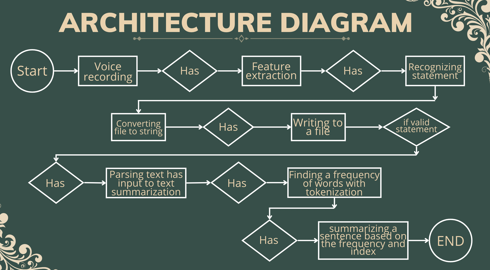

# Voicerra
An all-in-one Open-Source Notes App that deals with your problems, so you don't have to!

[](https://flutter.dev/)  
[](https://github.com/TheGuyDangerous/Voicerra/actions/workflows/flutter-ci.yml)

### Don't forget to :star: the repo

[](https://github.com//TheGuyDangerous/Voicerra)  


## Download

[](https://github.com/TheGuyDangerous/Voicerra/releases)
     
[](https://drive.google.com/drive/folders/1MdVPcMMjAOEnjj0p5Q-xle--GgGQMcTE?usp=share_link)
     
 ---
 ## Features
 
 - A Fully functional stand-alone notes app.
 - A Fully feature-rich Audio recorder.
 - store audio in highest quality in wav format.
 - An Offline transcriber.
 - An Online transcriber for longer durations.
 - Option to transcribe files by importing them.
 - A full fledged Translator app in itself.
 - Made for students with low multitasking skills who want to make notes quickly while focusing on the teaching itself.
 - Made of foreign students to better translate in different countries.
 - Made for deaf students who are weak at ASL (sign language).
 - Can help in General meeting and group discussions.
 - Ability to directly save the transcriptions within the app in the notes section.
 - Material UI Theming.
 - Impeller engine support for better performance.
 - No Ads


and much more...
Check it yourself :)

## Screenshots


        


## Building from Source

1. If you don't have Flutter SDK installed, please visit official [Flutter](https://flutter.dev/) site.
2. Fetch latest source code from master branch.

```
git clone https://github.com/TheGuyDangerous/Voicerra.git
```

3. Run the app with Android Studio or VS Code. Or the command line:

```
flutter pub get
flutter run
```


---

### Domains Used

1. Flutter
2. NLP(Natural Language Processing)
3. Neutral Network
4. Passing Tree
---


# Requirements
- Android Version : sdk 29 and above
- Connectivity : Active internet connection/offline features work too
- Device permission :
                      1. Microphone🎙
                      2. Bluetooth
                      3. Read/Write Storage


Logic
---



---
### Refer this
[BEHIND THE SCENES][link]

## License

```
Copyright © 2021 Sannidhya Dubey

Voicerra is a free software licensed under GPL v3.0
It is distributed in the hope that it will be useful, but WITHOUT ANY WARRANTY;
without even the implied warranty of MERCHANTABILITY or FITNESS FOR A PARTICULAR PURPOSE.
```

```
Being Open Source doesn't mean you can just make a copy of the app and upload it on playstore or sell
a closed source copy of the same.
Read the following carefully:
1. Any copy of a software under GPL must be under same license. So you can't upload the app on a closed source
  app repository like PlayStore/AppStore without distributing the source code.
2. You can't sell any copied/modified version of the app under any "non-free" license.
   You must provide the copy with the original software or with instructions on how to obtain original software,
   should clearly state all changes, should clearly disclose full source code, should include same license
   and all copyrights should be retained.

In simple words, You can ONLY use the source code of this app for `Open Source` Project under `GPL v3.0` or later
with all your source code CLEARLY DISCLOSED on any code hosting platform like GitHub, with clear INSTRUCTIONS on
how to obtain the original software, should clearly STATE ALL CHANGES made and should RETAIN all copyrights.
Use of this software under any "non-free" license is NOT permitted.
```

See the [GNU General Public License](https://github.com/TheGuyDangerous/Voicerra/blob/main/LICENSE) for more details.

## Contribute

Contributions are welcome. Please read our [contributing guidelines](https://github.com/TheGuyDangerous/Voicerra/blob/main/CONTRIBUTING.md) before contributing.

## Facing any Issue?

Have a look at some [common Issues](https://github.com/TheGuyDangerous/Voicerra/wiki/Common-Issues) that you might face. If your problem is not there, feel free to open an Issue :)

## What's New

To read full changelog visit the [project page](https://github.com/TheGuyDangerous/projects/1)

[link]: https://www.canva.com/design/DAFL7VmlLGM/Qyu6yU-HWp938SKF7U_48Q/view?utm_content=DAFL7VmlLGM&utm_campaign=designshare&utm_medium=link2&utm_source=sharebutton


