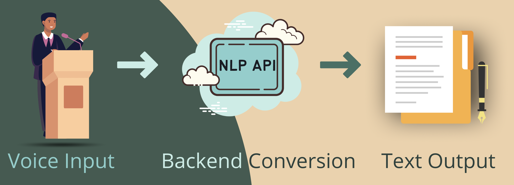
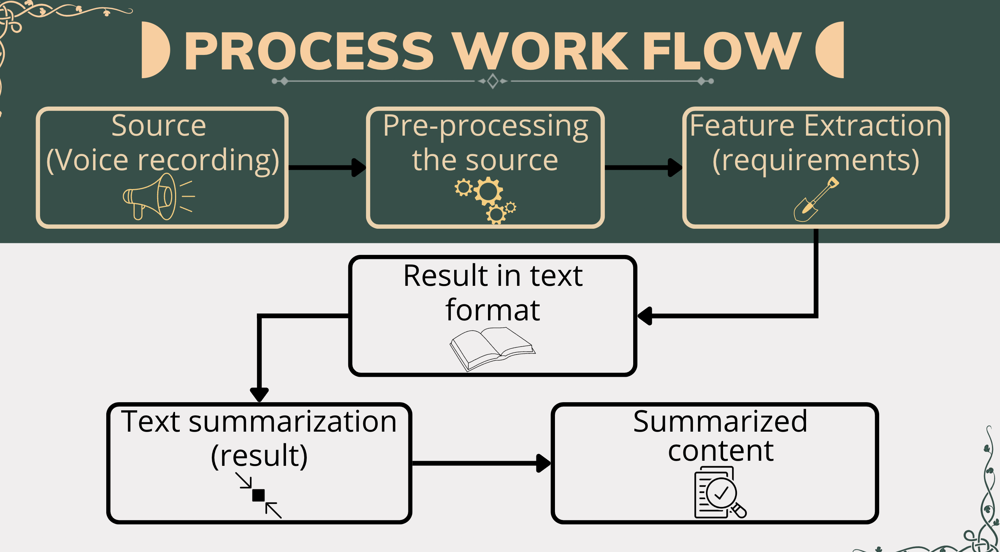
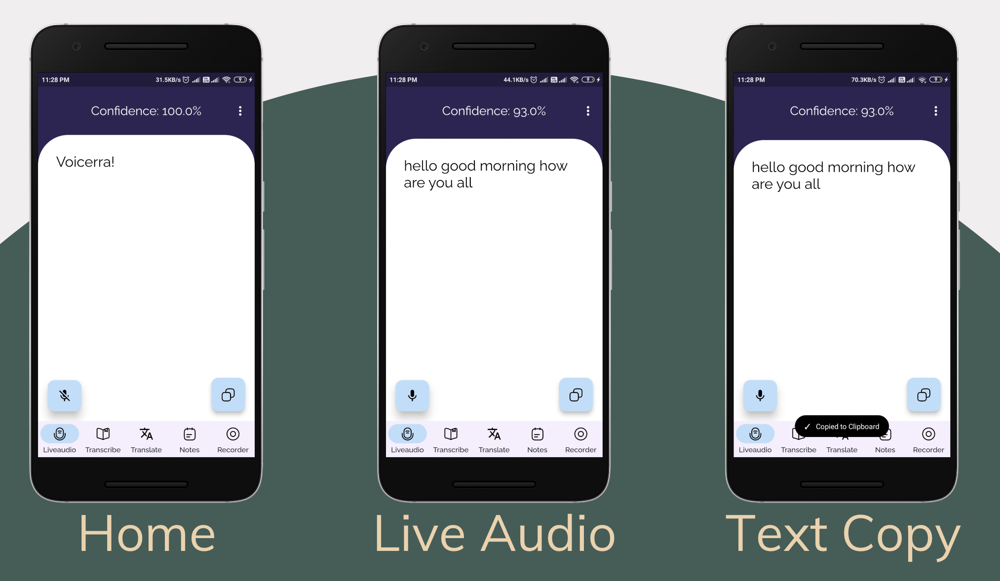
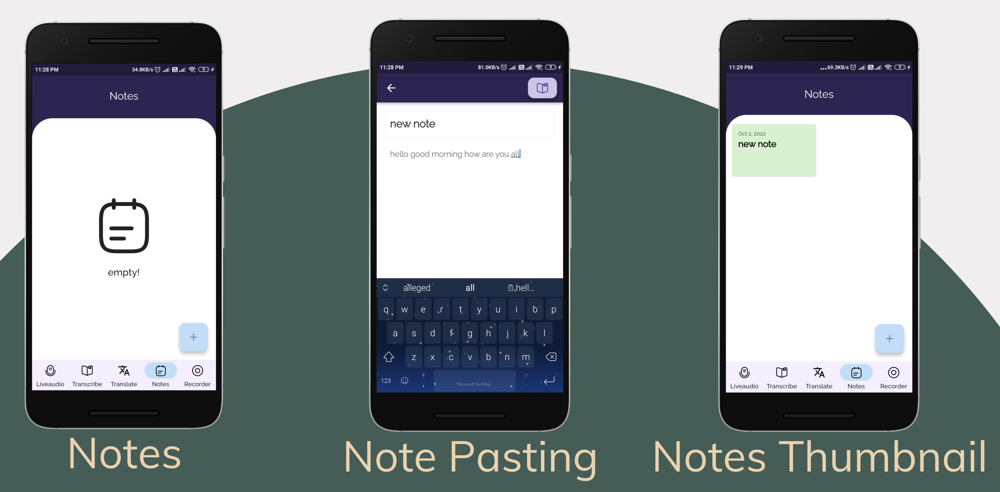
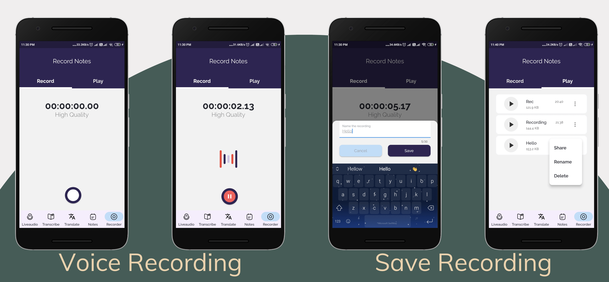
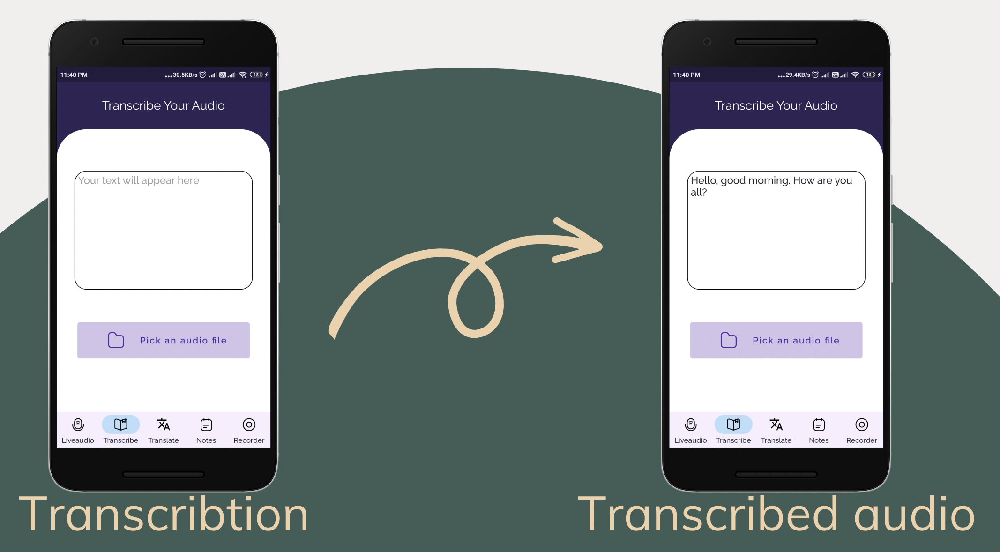
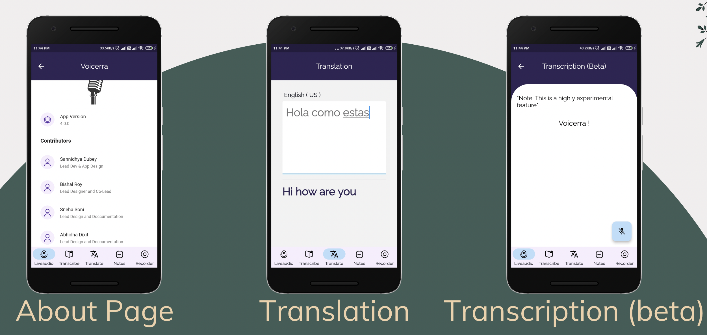

# VOICERRA📝
---
### Voicerra - Audio Revolution.
Presenting An all-in-one notes application that isn't limited with the note making part but also comes with a lot of functionalities which can easily deal with all your notes making problems.
This application is made using flutter and is a standalone application that uses API's from google for translation, transcription, voice-to-text conversions and more related tasks.

---
### Project Statement
Conversion of speech into text using NLP algorithm

---

### Domains Used

1. Flutter
2. NLP(Natural Language Processing)
3. Neutral Network
4. Passing Tree
---

---

### Real time usage
- CAN EASE THE TASK OF NOTE-MAKING
- CAN HELP DEAF STUDENTS TAKE NOTES
- CAN HELP IN GENERAL MEETINGS AND GROUP DISCUSSIONS
- CAN TRANSLATE THE LANGUAGE WHICH CAN REMOVE THE LANGUAGE BOUNDARY
- LIVE VOICE-TO-TEXT FEATURE AVAILABLE
- INBUILT VOICE RECORDER THAT CAN BE USED TO RECORD VOICE NOTES AND LATER BE TRANSCRIBED INTO TEXT USING INBUILT TRANSCRIBER

---

### Project Requirements
- Android Version : Android 6 & above
- Connectivity : Active internet connection
- Device permission :
                      1. Microphone🎙
                      2. Bluetooth
                      3. Read/Write Storage

---

---

---

# Screenshots

---

### Refer this
[Presentation Link][link]

[link]: https://www.canva.com/design/DAFL7VmlLGM/Qyu6yU-HWp938SKF7U_48Q/view?utm_content=DAFL7VmlLGM&utm_campaign=designshare&utm_medium=link2&utm_source=sharebutton

